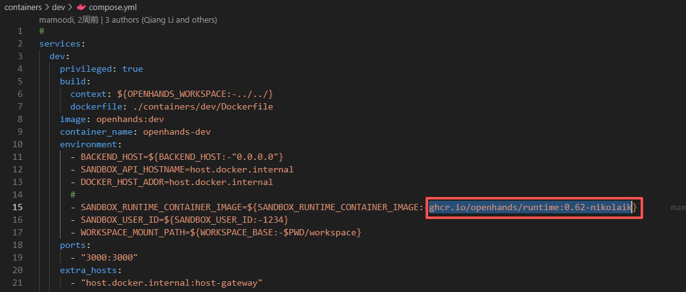
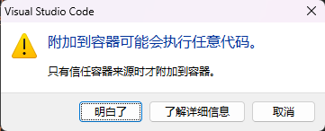
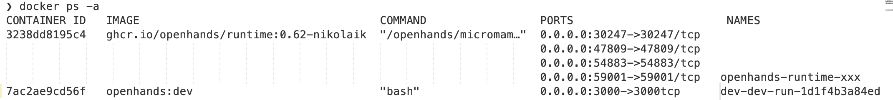
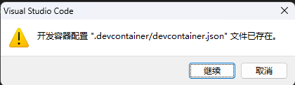
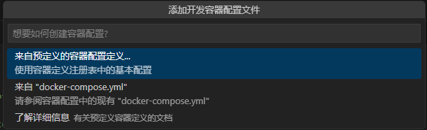

## 官方文档

**开发文档**

https://github.com/OpenHands/OpenHands/blob/main/Development.md


本地环境安装文档

https://docs.openhands.dev/openhands/usage/run-openhands/local-setup


**自定义sandbox沙箱镜像**

> 已有沙箱镜像，或者自定义创建了沙箱镜像，就不用再拉取镜像了

https://docs.openhands.dev/openhands/usage/advanced/custom-sandbox-guide

修改配置文件: config.toml

```shell
[core]
...
[sandbox]
base_container_image="custom-image"
```


## VsCode文档

**Developing inside a Container**

https://code.visualstudio.com/docs/devcontainers/containers


**Dev Containers FAQ**

https://code.visualstudio.com/docs/devcontainers/faq


**Attach to a running container**

https://code.visualstudio.com/docs/devcontainers/attach-container


**Development Containers**

https://containers.dev/


## 环境安装

### MacOS

1. [Install Docker Desktop on Mac](https://docs.docker.com/desktop/setup/install/mac-install).
2. Open Docker Desktop, go to `Settings > Advanced` and ensure `Allow the default Docker socket to be used` is enabled.

Tested with Ubuntu 22.04.

### Linux

> Tested with Ubuntu 22.04.
>
> 只安装docker或者docker-ce，无法正常搭建好环境

**Docker Desktop**

1. [Install Docker Desktop on Linux](https://docs.docker.com/desktop/setup/install/linux/).

### Windows

#### WSL

1. [安装 WSL | Microsoft Learn](https://learn.microsoft.com/zh-cn/windows/wsl/install)

2. Run `wsl --version` in powershell and confirm `Default Version: 2`.

   wsl安装

   ```shell
   wsl --install
   ```

   查看wsl版本

   > 如果`命令行选项无效: --version`

   - `wsl --version` 是 **较新版本 WSL 内核**（通常随 Windows 11 或 Windows 10 21H2+ 更新推送）才支持的命令。

     ```shell
     PS C:\Users\Administrator\Desktop> wsl --version
     WSL 版本: 2.6.1.0
     内核版本: 6.6.87.2-1
     WSLg 版本: 1.0.66
     MSRDC 版本: 1.2.6353
     Direct3D 版本: 1.611.1-81528511
     DXCore 版本: 10.0.26100.1-240331-1435.ge-release
     Windows: 10.0.22621.4317
     ```
   
   - 如果你系统较旧，或 WSL 内核未更新，该命令不存在。
   
     升级内核
   
     升级wsl
   
   - 你可以手动更新 WSL 内核：
   
     - 下载地址：https://aka.ms/wsl2kernel
   
       [旧版 WSL 的手动安装步骤 | Microsoft Learn](https://learn.microsoft.com/zh-cn/windows/wsl/install-manual#step-4---download-the-linux-kernel-update-package)
   
     - 安装后即可使用 `wsl --version`
     
   - 如果WSL版本较老：管理员运行PowerShell更新WSL
   
     > 可能需要科学上网，网络不好可能会卡主
   
     ```shell
     wsl --update
     ```
   
   如果不是2
   
   - 则这里设置默认版本为 WSL 2（可选但推荐）：
   
     ```shell
     wsl --set-default-version 2
     ```
   
   - 查看当前已有子系统的版本
   
     ```shell
     wsl -l -v
     
       NAME              STATE           VERSION
     * Ubuntu2404        Running         2
       docker-desktop    Running         2
     ```
   
   - 切换已有子系统的版本
   
     ```shell
     # 替换为 <Distro> 要更新的 Linux 分发版的名称
     wsl.exe --set-version <Distro> <1|2>
     
     # 将 Ubuntu 分发设置为使用 WSL 2
     wsl --set-version Ubuntu 2
     ```
   
   查看所有可用的发行版
   
   > 需要从https://raw.githubusercontent.com/microsoft/WSL/master/distributions/DistributionInfo.json下载查看，可能需要科学上网。
   
   ```shell
   wsl --list --online
   
   PS C:\Users\Administrator\Desktop> wsl -l -o
   以下是可安装的有效分发的列表。
   使用“wsl.exe --install <Distro>”安装。
   
   NAME                            FRIENDLY NAME
   AlmaLinux-8                     AlmaLinux OS 8
   AlmaLinux-9                     AlmaLinux OS 9
   AlmaLinux-Kitten-10             AlmaLinux OS Kitten 10
   AlmaLinux-10                    AlmaLinux OS 10
   Debian                          Debian GNU/Linux
   FedoraLinux-43                  Fedora Linux 43
   FedoraLinux-42                  Fedora Linux 42
   SUSE-Linux-Enterprise-15-SP7    SUSE Linux Enterprise 15 SP7
   SUSE-Linux-Enterprise-16.0      SUSE Linux Enterprise 16.0
   Ubuntu                          Ubuntu
   Ubuntu-24.04                    Ubuntu 24.04 LTS
   archlinux                       Arch Linux
   kali-linux                      Kali Linux Rolling
   openSUSE-Tumbleweed             openSUSE Tumbleweed
   openSUSE-Leap-16.0              openSUSE Leap 16.0
   Ubuntu-20.04                    Ubuntu 20.04 LTS
   Ubuntu-22.04                    Ubuntu 22.04 LTS
   OracleLinux_7_9                 Oracle Linux 7.9
   OracleLinux_8_10                Oracle Linux 8.10
   OracleLinux_9_5                 Oracle Linux 9.5
   openSUSE-Leap-15.6              openSUSE Leap 15.6
   SUSE-Linux-Enterprise-15-SP6    SUSE Linux Enterprise 15 SP6
   
   # 无法联网的情况
   无法从“https://raw.githubusercontent.com/microsoft/WSL/master/distributions/DistributionInfo.json”提取列表分发。无法解析服务器的名称或地址
   错误代码: Wsl/WININET_E_NAME_NOT_RESOLVED
   ```
   
   通过命令行直接安装（推荐）
   
   ```shell
   # 安装最新版
   wsl --install -d Ubuntu
   
   # 安装指定版本
   wsl --install -d Ubuntu-24.04
   ```
   
   或者 微软商店（Windows Store）安装
   
   - 打开链接：https://aka.ms/wslstore
   
     [安装 WSL | Microsoft Learn](https://learn.microsoft.com/zh-cn/windows/wsl/install)
   
   - 或直接在 **Microsoft Store** 中搜索 “**Ubuntu**”
   
   - 点击“安装”（推荐选择 **Ubuntu 22.04 LTS** 或 **Ubuntu 24.04 LTS**）
   
     ⚠️ 注意：你需要使用 **普通用户账户**（非 Administrator 账户）登录 Microsoft Store 才能安装应用。如果你当前是以 `Administrator` 身份登录且未绑定微软账户，Store 可能无法正常使用。
   
   - 下载`.appx` 或 `.tar.gz` 文件，导入指定路径**（推荐）**
   
     [旧版 WSL 的手动安装步骤 | Microsoft Learn](https://learn.microsoft.com/zh-cn/windows/wsl/install-manual#step-4---download-the-linux-kernel-update-package)（包含子系统的下载地址）
   
     [旧版 WSL 的手动安装步骤 | Microsoft Learn](https://learn.microsoft.com/zh-cn/windows/wsl/install-manual#downloading-distributions)（直接下载完整包的发行版）
   
     1. **先下载发行版的 Appx 包**（或从已安装的系统导出）：
   
        - 可以从 [Microsoft 官方 WSL 发行版页面]([旧版 WSL 的手动安装步骤 | Microsoft Learn](https://learn.microsoft.com/zh-cn/windows/wsl/install-manual#downloading-distributions)) 下载 `.appx` 或 `.tar.gz` 文件。
        - 或者先正常安装一次，然后用 `wsl --export` 导出。
   
     2. **创建目标目录**，例如：
   
        ```powershell
        mkdir D:\WSL\Ubuntu2204
        ```
   
     3. **导入发行版到指定位置**：
   
        ```powershell
        wsl --import Ubuntu2204 D:\WSL\Ubuntu2204 .\ubuntu2204.tar.gz --version 2
        ```
   
     4. **设置默认用户**（可选）： 因为 `--import` 默认以 root 登录，你可以创建 `/etc/wsl.conf` 来设置默认用户：
   
        > 子系统内部
   
        ```ini
        [user]
        default = yourusername
        ```
   
     5. **设置为默认发行版（可选）**：
   
        ```powershell
        wsl --set-default Ubuntu2204
        ```
   
   - 密码
   
     1. 通过 Microsoft Store 安装（如 Ubuntu、Debian 等）
   
        - **有密码设置流程**。
        - 第一次启动时，系统会提示你：
          - 创建一个**普通用户名**（不是 root）
          - 设置该用户的**密码**
        - 这个用户默认拥有 `sudo` 权限。
        - **root 用户默认没有密码**，但你可以通过 `sudo passwd root` 来设置。
   
        > 🔒 所以：**普通用户有密码，root 默认无密码（但可通过 sudo 切换）**
   
     2. 使用 `wsl --import` 导入 tar 包（比如官方 rootfs）
   
        - **默认以 root 用户登录**
        - **root 用户通常没有设置密码**（即空密码，但 Linux 一般不允许空密码登录）
        - 因为你直接进入 shell，**不需要输入密码**
        - 此时：
          - 你就是 root
          - 没有其他用户（除非你自己创建）
          - 如果你运行 `passwd`，可以给 root 设置密码
          - 但**这个密码在 WSL 中几乎用不到**，因为 WSL 不涉及传统登录
   
        > ⚠️ 注意：WSL 启动时不经过 Linux 的 login 或 PAM 验证，所以“密码”主要用于：
        >
        > - `sudo`（但 root 不需要 sudo）
        > - SSH 登录（如果你启用了 SSH 服务）
        > - 手动切换用户（如 `su alice`）
   
        - 如何检查或设置密码
   
          创建普通用户并设密码（推荐）：
   
          > 然后按提示输入密码（输入时不会显示字符，正常输入回车即可）。
   
          ```shell
          adduser alice
          ```
   
          ✅ 最佳实践建议
   
          1. **不要长期用 root**，创建一个普通用户。
          2. **给普通用户设密码**（虽然日常不用输，但用于 `sudo` 和安全性）。
          3. 如果你要开启 SSH 服务，**必须设置密码**（或配置密钥）。
   

#### Ubuntu (Linux Distribution)

1. Install Ubuntu: `wsl --install -d Ubuntu` in PowerShell as Administrator.
2. Restart computer when prompted.
3. Open Ubuntu from Start menu to complete setup.
4. Verify installation: `wsl --list` should show Ubuntu.

#### Docker Desktop

1. [Install Docker Desktop on Windows](https://docs.docker.com/desktop/setup/install/windows-install).
2. Open Docker Desktop, go to `Settings` and confirm the following:

- General: `Use the WSL 2 based engine` is enabled.
- Resources > WSL Integration: `Enable integration with my default WSL distro` is enabled.

The docker command below to start the app must be run inside the WSL terminal. Use `wsl -d Ubuntu` in PowerShell or search “Ubuntu” in the Start menu to access the Ubuntu terminal.


### 代码依赖

安装python：

安装pipx：pip install pipx

安装poetry：pipx install poetry

添加更新依赖：poetry install


### 安装VsCode

#### 禁止VsCode自动更新（推荐）

> 远程连接需要在容器内部安装VsCode Server端，客户端更新，连接Server端也会更新，相对耗时

在 VS Code 中禁止自动更新，可以通过修改设置来实现。以下是具体方法（适用于 **VS Code 桌面版**，包括 Windows、macOS 和 Linux）：

------

##### ✅ 方法一：通过设置界面禁用更新（推荐）

1. 打开 VS Code。
2. 进入设置：
   - **Windows/Linux**：`文件 (File)` → `首选项 (Preferences)` → `设置 (Settings)`
   - **macOS**：`Code` → `Preferences` → `Settings`
3. 在搜索框中输入 `update mode`。
4. 找到 **`Update: Mode`** 选项。
5. 将其值从默认的 `default` 改为 **`none`**。

> 效果：VS Code 将完全禁止检查和安装任何更新（包括安全更新）。

------

##### ✅ 方法二：通过 `settings.json` 配置

1. 打开命令面板（`Ctrl+Shift+P` 或 `Cmd+Shift+P`）。
2. 输入并选择 **`Preferences: Open Settings (JSON)`**。
3. 在打开的 `settings.json` 文件中添加以下行：

```json
1{
2  "update.mode": "none"
3}
```

保存即可。

------

##### ⚠️ 注意事项

- 设置

  ```
  "update.mode": "none" 
  ```

  仅对 VS Code 桌面应用程序本身生效

  ，不影响：

  - Extensions（扩展）的自动更新（可通过 `"extensions.autoUpdate": false` 单独关闭）
  - Dev Container 或远程开发环境中的工具更新

- 如果你使用的是 **VS Code Insiders 版本**，同样适用上述设置。

- 在企业环境中，也可以通过组策略（Windows）或配置文件集中管理此设置。

------

##### 🔒 额外：禁止扩展自动更新（可选）

如果你也想禁止扩展自动更新，加上：

```json
1{
2  "extensions.autoUpdate": false
3}
```

------

完成以上设置后，VS Code 就不会再提示或自动下载新版本了。如需手动更新，需重新启用更新或从官网下载安装包覆盖安装。


## 在Docker container开发

### 官方方式devcontainer

#### 安装docker compose

##### 命令行docker安装

`docker compose`: Docker CLI 插件，新版，docker-compose集成在 Docker Desktop 或通过 `docker-compose-plugin` 安装

**yum安装 `docker-compose-plugin`**

> yum 安装的docker，使用该方式

```shell
sudo yum install docker-compose-plugin
# 或 dnf（较新版本）
sudo dnf install docker-compose-plugin
```

**手动安装（通用）：**

```shell
# 获取最新版本号
VERSION=$(curl -s https://api.github.com/repos/docker/compose/releases/latest | grep tag_name | cut -d '"' -f 4)

# 下载插件（注意架构：amd64 / arm64）
mkdir -p ~/.docker/cli-plugins
curl -SL "https://github.com/docker/compose/releases/download/${VERSION}/docker-compose-$(uname -s)-$(uname -m)" -o ~/.docker/cli-plugins/docker-compose

# 赋予执行权限
chmod +x ~/.docker/cli-plugins/docker-compose

# 举例：https://github.com/docker/compose/releases/download/v2.40.3/docker-compose-linux-x86_64
```

**验证**

```
docker compose version
# 应输出：Docker Compose version v2.x.x
```


##### 在 Windows 或 macOS 上使用 **Docker Desktop**

- **Docker Desktop 默认已内置 `docker compose`**（v2+）；
- 如果报错，说明：
  - Docker Desktop 版本太旧（< 3.4）
  - Compose V2 被禁用

解决方法：

1. **升级 Docker Desktop** 到最新版；

2. 打开 Docker Desktop → Settings →General

   - ✅ 勾选 **“Use Docker Compose V2”**

3. 重启 Docker Desktop；

4. 验证：

   ```powershell
   docker compose version
   ```


#### 安装vscode远程开发插件

**Remote Development**

> 支持`Attach to Running Kubernetes Container...`

包含4个插件包：

- WSL
- Dev Containers：支持`Dev Containers: Reopen in Container`
- Remote - SSH
- Remote - Tunnels


**Dev Containers**

https://marketplace.visualstudio.com/items?itemName=ms-vscode-remote.remote-containers


**Remote Development**

https://marketplace.visualstudio.com/items?itemName=ms-vscode-remote.vscode-remote-extensionpack


#### 创建dev容器环境

```shell
cd containers/dev
./dev.sh

# 执行containers/dev/compose.yml的docker-compose的相关内容

# 代码挂载在/app目录下
# 执行完成命令后，命令行显示为下面这种形式表示已创建好镜像，并启动容器
# 第一次执行会创建镜像等耗时较长(创建镜像+拉取镜像+安装VsCode Server)，后面执行立即返回(docker-compose up效果)
root@76a5c21f8e84:/app# 
```

- 创建名为openhands:dev的镜像
- 运行该镜像的容器用于调试，名称为：dev-dev-run-xxx随机数
- 需要下载的运行时镜像




#### VsCode连接容器环境

> VsCode快捷键：(Ctrl+Shift+P)


#### 连接容器环境

连接运行的容器

```shell
Dev Containers: Attach to Running Container...
```


安全确认



容器选择

```shell
/dev-dev-xxxx的容器，镜像是openhands:dev
```


> 连接容器，会在容器中下载对应版本的VsCode

连接成功效果

 


#### VsCode打开代码

**目录选择**

/app


**选择python环境**

/root/.cache/pypoetry/virtualenvs/openhands-ai-9TtSrW0h-py3.12

> 这里有全套的python环境

激活环境

```shell
root@76a5c21f8e84:/app# source /root/.cache/pypoetry/virtualenvs/openhands-ai-9TtSrW0h-py3.12/bin/activate
```


**VsCode安装插件**

> python开发调试插件

- Python
- Python Debugger


#### 编译、运行前端

> 新开终端，运行会一个占用终端。会拉取nodejs依赖库代理，有代理会更快。

```shell
cd frontend

npm install

# 详细过程（推荐调试用）：显示每个包的下载、解压、链接过程
# npm install --loglevel verbose
# 或更详细的，极其详细（含网络请求、内部状态）：查看完整调试日志（排查安装失败时很有用）
# npm install --loglevel silly

npm run build
```

##### 如果无法下载

DNS无法解析

```shell
nslookup registry.npmjs.org
# 或
dig registry.npmjs.org +short
```

1.**修改DNS**

> 可以临时修改 `/etc/resolv.conf`

```shell
echo "nameserver 8.8.8.8" > /etc/resolv.conf
echo "nameserver 1.1.1.1" >> /etc/resolv.conf
```

2.**修改docker的容器配置**

```shell
vi /etc/docker/daemon.json

{
  "ipv6": false,
  "experimental": false,
  "dns": ["8.8.8.8", "1.1.1.1"]
}
```

🔸 `"ipv6": false` 是关键，它会禁止 Docker 在创建网络时启用 IPv6。
🔸 同时建议配置可靠 DNS（如 `8.8.8.8`）和镜像加速器。

**重启 Docker 服务**

```shell
sudo systemctl daemon-reload
sudo systemctl restart docker
```


**创建launch.json调试文件**

调试器选择：Python Debugger

调试配置选择：带有参数的Python文件 - 使用参数调试当前活动的python文件

> 选项1和2没有太大区别，只是配置有一些不同，下面会覆盖配置


修改调整配置信息如下：

```json
{
    // 使用 IntelliSense 了解相关属性。 
    // 悬停以查看现有属性的描述。
    // 欲了解更多信息，请访问: https://go.microsoft.com/fwlink/?linkid=830387
    "version": "0.2.0",
    "configurations": [
        {
            "name": "Python 调试程序: 包含参数的当前文件",
            "type": "debugpy",
            "request": "launch",
            "program": "${workspaceFolder}/openhands/server/__main__.py",
            "cwd": "${workspaceFolder}",
            "console": "integratedTerminal",
            "args": ["--reload", "--port", "3000"]
        }
    ]
}
```


#### 启动调试

> 设置好断点，F5启动调试


打开浏览器访问

http://127.0.0.1:3000


配置大模型信息，创建新的对话


1. 会下载镜像，镜像根据从github下载的代码版本有关

```shell
ghcr.io/openhands/agent-server:15f565b-python
```

代码的路径：`openhands/app_server/sandbox/sandbox_spec_service.py`


2. 运行时环境

   > 下载镜像

   ```shell
   ghcr.io/openhands/runtime:0.62-nikolaik
   ```

   不用下载`ghcr.io/openhands/openhands:0.62`，这个镜像就是调试server端的代码。

3. 使用镜像运行容器

   

   

**无法监控到文件**：文件描述符过少

https://code.visualstudio.com/docs/setup/linux#_visual-studio-code-is-unable-to-watch-for-file-changes-in-this-large-workspace-error-enospc

```shell
# 查看当前
cat /proc/sys/fs/inotify/max_user_watches

# 调整
vi /etc/sysctl.conf
# 加入 或 修改
fs.inotify.max_user_watches=524288

# 生效
sudo sysctl -p

# 再次查看
cat /proc/sys/fs/inotify/max_user_watches
```


### 社区方式devcontainer

#### 安装docker buildx

**下载docker buildx**

VS Code 的 Dev Containers（尤其是较新版本）默认会尝试使用 `docker buildx` 来构建镜像（因为它支持 BuildKit、多平台构建等高级功能）。

> 创建镜像的时候需要用到docker buildx命令，buildx是docker的插件。
>
> `docker buildx` 是 Docker 的一个 **CLI 插件**，并不是所有 Docker 安装都默认包含它。

**下载最新 buildx 插件**

```shell
mkdir -p ~/.docker/cli-plugins

# 查看当前最新版本
curl -s https://api.github.com/repos/docker/buildx/releases/latest | grep tag_name | cut -d '"' -f 4 | cut -c 2-

# 安装最新版本
curl -SL "https://github.com/docker/buildx/releases/latest/download/buildx-v$(curl -s https://api.github.com/repos/docker/buildx/releases/latest | grep tag_name | cut -d '"' -f 4 | cut -c 2-).linux-amd64" -o ~/.docker/cli-plugins/docker-buildx
```

**验证下载**

```shell
# 确认插件文件存在且可执行
ls -l ~/.docker/cli-plugins/docker-buildx -h
# 正常输出应类似：有执行权限，大小单位为MB，而不是几十KB
# -rwxr-xr-x 1 root root 68M 11月 23 15:34 /root/.docker/cli-plugins/docker-buildx

# 快速检查是否下载了真实二进制：
file ~/.docker/cli-plugins/docker-buildx
# 正确应显示：ELF 64-bit LSB executable, x86-64...
# 如果显示：ASCII text 或 HTML document → 说明下载的是错误页面！
```

**验证执行权限**

> 不需要重启docker

```shell
# 赋予执行权限
chmod +x ~/.docker/cli-plugins/docker-buildx

# 验证
docker buildx version
# 输出类似：github.com/docker/buildx v0.30.1 ...

# 手动验证
~/.docker/cli-plugins/docker-buildx version

# 测试能否创建 builder
docker buildx create --use

# 测试 buildx 是否能驱动 BuildKit
# docker buildx create --name test --use
# docker buildx inspect --bootstrap
# 如果 inspect 显示状态为 running，说明兼容性没问题。
```


**安装指定版本**

```shell
curl -L https://github.com/docker/buildx/releases/latest/download/buildx-v0.30.1.linux-amd64 -o ~/.docker/cli-plugins/docker-buildx
```


#### 打开远程容器环境.devcontainer

> 会用.devcontainer文件夹下的devcontainer.json来配置和启动容器环境。
>
> 这种运行OpenHands的方式并非官方支持，而是由社区维护的。

会下载镜像：

- `mcr.microsoft.com/devcontainers/python:1-3.12-bullseye`
- `moby/buildkit:buildx-stable-1`


1. **用 VS Code 打开项目根目录**

   > 项目根目录必须包含`.devcontainer/devcontainer.json`文件

   **方式一：命令行打开**

   ```bash
   cd /path/to/your/project
   
   # 在项目目录中执行，不需要在.devcontainer目录下执行
   code .
   ```

   **方式二：VsCode直接打开项目**

   选择项目根目录

2. **手动触发“在容器中重新打开”**

   - 按快捷键：`Ctrl+Shift+P`（Windows/Linux）或 `Cmd+Shift+P`（macOS）

   - 输入命令：

     ```text
     Dev Containers: Reopen in Container
     ```

     > 第一次执行Reopen in Container，后续执行Attach to Running Container...。

   - 回车执行

   - **读取开发容器配置(显示日志)，看是否报错**

   - devcontainer.json文件已存在，点击`继续`。点击`取消`则终止连接容器。

     

   - 添加开发容器配置文件：

     

     

3. **VS Code 会自动执行以下流程：**

   > 过程中会下载镜像和代码，安装部分工具。**如果有代理会更快。**

   - 构建 Docker 镜像（首次较慢）/ 使用指定的镜像(**会拉取基础镜像**)
   - **自动下载并执行每个 Feature 的安装脚本**（通常是 shell 脚本），官方 Feature 库：https://containers.dev/features
   - **按顺序安装指定的工具/服务**
   - **最终生成一个包含所有所需开发工具的容器环境**（vsc-propject-xxx）
     - (vsc-openhands-3724fa83fea081c6d98f7b69a59f554d5c405fcad09a5c5a7c23eda45dadcfee-features)
   - 启动容器
   - 挂载项目代码
   - 安装指定的 VS Code 扩展
   - 打开终端（此时已在容器内）

✅ 成功后，VS Code 左下角状态栏会显示容器名称（如 `Dev Container: YourProject`）。


#### 🔍 如何确认容器是否在运行？

终端执行：

```bash
docker ps
```

你会看到类似：

```text
CONTAINER ID   IMAGE                     COMMAND                  ...
abcd1234       vsc-yourproject-xxxxxx   "/bin/sh -c 'echo Co…"   ...
```

这个就是 Dev Container 创建的容器。


#### 连接到一个**已经运行的 Dev Container**

如果你之前已经启动过容器，但关闭了 VS Code，现在想重新连接：

1. 打开 VS Code

2. ```text
   Ctrl+Shift+P
   ```

   → 输入：

   ```text
   Dev Containers: Attach to Running Container...
   ```

1. 从列表中选择对应的容器（通常以项目名或镜像名标识）
2. VS Code 会 attach 进去，并挂载原项目目录（需路径一致）

> ⚠️ 注意：Attach 模式不会自动挂载代码，建议优先使用 “Reopen in Container”。


### k8s方式

> 这个是连接k8s的容器环境，没有安装k8s，我们使用的docker容器环境调试，说以不要选择这个。

```shell
Dev Containers: Attach to Running Kubernetes Container...
```

