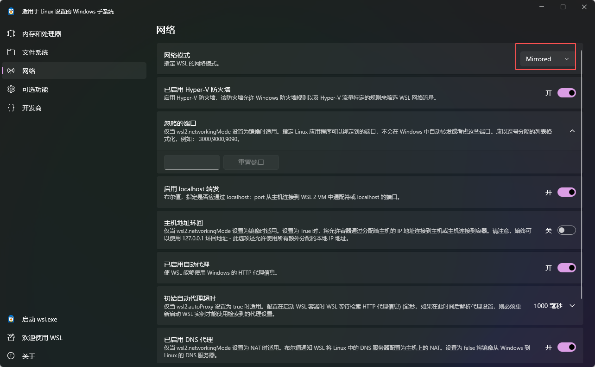

# WSL

官方地址：[安装 WSL | Microsoft Learn](https://learn.microsoft.com/zh-cn/windows/wsl/install)


## 安装准备

### **查看wsl版本**

> 如果`命令行选项无效: --version`

- `wsl --version` 是 **较新版本 WSL 内核**（通常随 Windows 11 或 Windows 10 21H2+ 更新推送）才支持的命令。

  ```shell
  PS C:\Users\Administrator\Desktop> wsl --version
  WSL 版本: 2.6.1.0
  内核版本: 6.6.87.2-1
  WSLg 版本: 1.0.66
  MSRDC 版本: 1.2.6353
  Direct3D 版本: 1.611.1-81528511
  DXCore 版本: 10.0.26100.1-240331-1435.ge-release
  Windows: 10.0.22621.4317
  ```

- 如果你系统较旧，或 WSL 内核未更新，该命令不存在。

  升级内核

  升级wsl


### **升级WSL内核**

- 你可以手动更新 WSL 内核：

  - 下载地址：https://aka.ms/wsl2kernel

    [旧版 WSL 的手动安装步骤 | Microsoft Learn](https://learn.microsoft.com/zh-cn/windows/wsl/install-manual#step-4---download-the-linux-kernel-update-package)

  - 安装后即可使用 `wsl --version`

- 如果WSL版本较老：管理员运行PowerShell更新WSL

  > 可能需要科学上网，网络不好可能会卡主

  ```shell
  wsl --update
  ```


### **设置WSL版本**

```shell
wsl --version

PS C:\Users\Administrator\Desktop> wsl --version
WSL 版本: 2.6.1.0
```

如果不是2

- 则这里设置默认版本为 WSL 2（可选但推荐）：

  ```shell
  wsl --set-default-version 2
  ```


### **子系统设置版本**

- 查看当前已有子系统的版本

  ```shell
  wsl -l -v
  
    NAME              STATE           VERSION
  * Ubuntu2404        Running         2
    docker-desktop    Running         2
  ```

- 切换已有子系统的版本

  ```shell
  # 替换为 <Distro> 要更新的 Linux 分发版的名称
  wsl.exe --set-version <Distro> <1|2>
  
  # 将 Ubuntu 分发设置为使用 WSL 2
  wsl --set-version Ubuntu 2
  ```


## 安装WSL

### 命令行安装

Run `wsl --version` in powershell and confirm `Default Version: 2`.

```shell
wsl --install
```


**查看所有可用的发行版**

> 需要从https://raw.githubusercontent.com/microsoft/WSL/master/distributions/DistributionInfo.json下载查看，可能需要科学上网。

```shell
wsl --list --online

PS C:\Users\Administrator\Desktop> wsl -l -o
以下是可安装的有效分发的列表。
使用“wsl.exe --install <Distro>”安装。

NAME                            FRIENDLY NAME
AlmaLinux-8                     AlmaLinux OS 8
AlmaLinux-9                     AlmaLinux OS 9
AlmaLinux-Kitten-10             AlmaLinux OS Kitten 10
AlmaLinux-10                    AlmaLinux OS 10
Debian                          Debian GNU/Linux
FedoraLinux-43                  Fedora Linux 43
FedoraLinux-42                  Fedora Linux 42
SUSE-Linux-Enterprise-15-SP7    SUSE Linux Enterprise 15 SP7
SUSE-Linux-Enterprise-16.0      SUSE Linux Enterprise 16.0
Ubuntu                          Ubuntu
Ubuntu-24.04                    Ubuntu 24.04 LTS
archlinux                       Arch Linux
kali-linux                      Kali Linux Rolling
openSUSE-Tumbleweed             openSUSE Tumbleweed
openSUSE-Leap-16.0              openSUSE Leap 16.0
Ubuntu-20.04                    Ubuntu 20.04 LTS
Ubuntu-22.04                    Ubuntu 22.04 LTS
OracleLinux_7_9                 Oracle Linux 7.9
OracleLinux_8_10                Oracle Linux 8.10
OracleLinux_9_5                 Oracle Linux 9.5
openSUSE-Leap-15.6              openSUSE Leap 15.6
SUSE-Linux-Enterprise-15-SP6    SUSE Linux Enterprise 15 SP6

# 无法联网的情况
无法从“https://raw.githubusercontent.com/microsoft/WSL/master/distributions/DistributionInfo.json”提取列表分发。无法解析服务器的名称或地址
错误代码: Wsl/WININET_E_NAME_NOT_RESOLVED
```

通过命令行直接安装（推荐）

```shell
# 安装最新版
wsl --install -d Ubuntu

# 安装指定版本
wsl --install -d Ubuntu-24.04
```


### 微软商店（Windows Store）安装

打开链接：https://aka.ms/wslstore

安装文档：[安装 WSL | Microsoft Learn](https://learn.microsoft.com/zh-cn/windows/wsl/install)


- 或直接在 **Microsoft Store** 中搜索 “**Ubuntu**”

- 点击“安装”（推荐选择 **Ubuntu 22.04 LTS** 或 **Ubuntu 24.04 LTS**）

  ⚠️ 注意：你需要使用 **普通用户账户**（非 Administrator 账户）登录 Microsoft Store 才能安装应用。如果你当前是以 `Administrator` 身份登录且未绑定微软账户，Store 可能无法正常使用。


### 离线安装

下载`.appx` 或 `.tar.gz` 文件，导入指定路径**（推荐）**

[旧版 WSL 的手动安装步骤 | Microsoft Learn](https://learn.microsoft.com/zh-cn/windows/wsl/install-manual#step-4---download-the-linux-kernel-update-package)（包含子系统的下载地址）

[旧版 WSL 的手动安装步骤 | Microsoft Learn](https://learn.microsoft.com/zh-cn/windows/wsl/install-manual#downloading-distributions)（直接下载完整包的发行版）

1. **先下载发行版的 Appx 包**（或从已安装的系统导出）：

   - 可以从 [Microsoft 官方 WSL 发行版页面]([旧版 WSL 的手动安装步骤 | Microsoft Learn](https://learn.microsoft.com/zh-cn/windows/wsl/install-manual#downloading-distributions)) 下载 `.appx` 或 `.tar.gz` 文件。
   - 或者先正常安装一次，然后用 `wsl --export` 导出。

2. **创建目标目录**，例如：

   ```powershell
   mkdir D:\WSL\Ubuntu2204
   ```

3. **导入发行版到指定位置**：

   ```powershell
   wsl --import Ubuntu2204 D:\WSL\Ubuntu2204 .\ubuntu2204.tar.gz --version 2
   ```

4. **设置默认用户**（可选）： 因为 `--import` 默认以 root 登录，你可以创建 `/etc/wsl.conf` 来设置默认用户：

   > 子系统内部

   ```ini
   [user]
   default = yourusername
   ```

5. **设置为默认发行版（可选）**：

   ```powershell
   wsl --set-default Ubuntu2204
   ```


### WSL密码

#### 通过 Microsoft Store 安装（如 Ubuntu、Debian 等）

- **有密码设置流程**。
- 第一次启动时，系统会提示你：
- 创建一个**普通用户名**（不是 root）
- 设置该用户的**密码**
- 这个用户默认拥有 `sudo` 权限。
- **root 用户默认没有密码**，但你可以通过 `sudo passwd root` 来设置。

> 🔒 所以：**普通用户有密码，root 默认无密码（但可通过 sudo 切换）**


#### 使用 `wsl --import` 导入 tar 包（比如官方 rootfs）

- **默认以 root 用户登录**
- **root 用户通常没有设置密码**（即空密码，但 Linux 一般不允许空密码登录）
- 因为你直接进入 shell，**不需要输入密码**
- 此时：
  - 你就是 root
  - 没有其他用户（除非你自己创建）
  - 如果你运行 `passwd`，可以给 root 设置密码
  - 但**这个密码在 WSL 中几乎用不到**，因为 WSL 不涉及传统登录

> ⚠️ 注意：WSL 启动时不经过 Linux 的 login 或 PAM 验证，所以“密码”主要用于：
>
> - `sudo`（但 root 不需要 sudo）
> - SSH 登录（如果你启用了 SSH 服务）
> - 手动切换用户（如 `su alice`）

- 如何检查或设置密码

  创建普通用户并设密码（推荐）：

  > 然后按提示输入密码（输入时不会显示字符，正常输入回车即可）。

  ```shell
  adduser alice
  ```

  ✅ 最佳实践建议

  1. **不要长期用 root**，创建一个普通用户。
  2. **给普通用户设密码**（虽然日常不用输，但用于 `sudo` 和安全性）。
  3. 如果你要开启 SSH 服务，**必须设置密码**（或配置密钥）。


### WSL其他设置

[WSL 中的高级设置配置 | Microsoft Learn](https://learn.microsoft.com/zh-cn/windows/wsl/wsl-config#configure-global-options-with-wslconfig)

[WSL 中的高级设置配置 | Microsoft Learn](https://learn.microsoft.com/zh-cn/windows/wsl/wsl-config#wslconf) wslconf

[WSL 中的高级设置配置 | Microsoft Learn](https://learn.microsoft.com/zh-cn/windows/wsl/wsl-config#wslconfig) wslconfig

[如何管理 WSL 磁盘空间 | Microsoft Learn](https://learn.microsoft.com/zh-cn/windows/wsl/disk-space)


> `wsl.conf` 用于根据 WSL 发行版应用设置，`.wslconfig` 用于将全局设置应用于 WSL

| 方面  | `.wslconfig`                                                 | `wsl.conf`                                                   |
| :---- | :----------------------------------------------------------- | :----------------------------------------------------------- |
| Scope | 适用于所有 WSL 的常规设置                                    | 仅限 WSL 分发的设置                                          |
| 配置  | WSL 中的功能启用、为 WSL 2 提供支持的虚拟机设置（RAM、要启动的内核、CPU 数等） | WSL 中的分发设置，例如启动选项、DrvFs 自动装载、网络、与 Windows 系统的互作性、系统使用情况和默认用户 |
| 位置  | `%UserProfile%\.wslconfig`，在 WSL 分发之外                  | `/etc/wsl.conf`，而在 WSL 分发中                             |

设置完成后需要重启

```shell
# 查看全部运行的
wsl --list --running

# 关闭指定的
wsl --terminate <distroName>
```


#### .wslconfig

> C:\Users\<UserName>\.wslconfig

建议直接在 WSL 设置中修改 WSL 配置，而不是手动编辑 .wslconfig 文件。 可以在“开始”菜单中找到 WSL 设置。 

网络模式：Mirrored




**总结对比**

| 模式        | 是否用户可选 | IP 特点               | 外部可访问性 | 支持版本          |
| ----------- | ------------ | --------------------- | ------------ | ----------------- |
| NAT         | 否（默认）   | 私有 IP（每次可能变） | 需端口转发   | WSL2 全版本       |
| Mirrored    | 是（实验性） | **与主机相同**        | 直接可访问   | Win11 22H2+       |
| VirtioProxy | 否（底层）   | —                     | —            | WSL2 内部机制     |
| None        | 间接支持     | 无网络                | 不可访问     | 特殊配置/故障情况 |


#### localhost转发

WSL2 运行在一个轻量级的 Hyper-V 虚拟机中，拥有自己的虚拟网络接口和私有 IP 地址（如 `172.28.123.45`）。

**localhost 转发** 是指：当你在 Windows 上访问 `localhost:端口` 时，如果该端口在 WSL2 中有服务正在监听，Windows 会自动将这个请求**透明地转发**到 WSL2 虚拟机中的对应端口。

- WSL2 启动时，会与 Windows 主机建立一个 **Virtio 网络通道**。
- Windows 监听本地回环地址（`127.0.0.1`）上的 TCP 连接。
- 当检测到某个端口在 WSL2 中处于 **LISTEN** 状态，Windows 会动态创建一个 **端口代理（port proxy）**，将 `127.0.0.1:端口` 的流量转发到 WSL2 的虚拟 IP 对应端口。
- 这个过程对用户**完全透明**，无需手动配置 `netsh portproxy`。


#### 网络

- [使用 WSL 访问网络应用程序 | Microsoft Learn](https://learn.microsoft.com/zh-cn/windows/wsl/networking#mirrored-mode-networking)  网络模式：NAT Mirroed
- [使用 WSL 访问网络应用程序 | Microsoft Learn](https://learn.microsoft.com/zh-cn/windows/wsl/networking#auto-proxy) 代理：自动代理


#### wsl.conf

> /etc/wsl.conf

```shell
vi /etc/wsl.conf

# 启用 systemd
[boot]
systemd=true

# 验证是否生效
# systemctl list-unit-files --type=service

# 启动root权限
[user]
default=root
```


#### 查看 WSL2 的实际 IP（用于手动访问）

```shell
hostname -I
# 输出如：172.28.123.45
```


#### wsl关闭ipv6

```shell
vi /etc/sysctl.conf

# 在文件末尾添加以下内容
# Disable IPv6
net.ipv6.conf.all.disable_ipv6 = 1
net.ipv6.conf.default.disable_ipv6 = 1
net.ipv6.conf.lo.disable_ipv6 = 1

# 立即应用配置
sudo sysctl -p
```

验证 IPv6 是否已禁用

```shell
cat /proc/sys/net/ipv6/conf/all/disable_ipv6
```

- 输出 1 表示已禁用
- 输出 0 表示仍启用

也可以用

```shell
ip a
```

查看是否还有 inet6 地址


### 启动子系统

```shell
# 列出当前系统
wsl -l

# 或显示更详细信息（包括状态和版本）
wsl -l -v

# 启动指定发行版（如 Ubuntu）：
wsl

# 启动指定发行版（如 Ubuntu）：
wsl -d Ubuntu

# 设置默认发行版（比如设为 Ubuntu）：
wsl --set-default Ubuntu

# 带版本号的版本
wsl -d Ubuntu-22.04
```


### 退出子系统

```shell
# 退出当前终端会话（最常用）
exit

# 关闭当前 shell 会话。如果这是最后一个会话，WSL 后台实例会在一段时间后自动终止（默认行为）
Ctrl + D

# 立即终止指定的 WSL 发行版：在 Windows 的 PowerShell 或 CMD 中运行
wsl --terminate Ubuntu

# 终止所有 WSL 实例
# 这会关闭所有正在运行的 WSL 发行版，并停止 WSL2 的轻量级虚拟机（适用于 WSL2）。常用于释放资源或解决网络/端口占用问题。
wsl --shutdown
```

示例

```shell
# 查看正在运行的发行版
wsl -l -v

# 输出示例：
#   NAME      STATE      VERSION
# * Ubuntu    Running    2

# 关闭 Ubuntu
wsl --terminate Ubuntu

# 或者直接全部关闭
wsl --shutdown
```


### Windows 终端概述

[Windows 终端概述 | Microsoft Learn](https://learn.microsoft.com/zh-cn/windows/terminal/)

[Windows 终端安装 | Microsoft Learn](https://learn.microsoft.com/zh-cn/windows/terminal/install)

下载：

https://github.com/microsoft/terminal/releases

