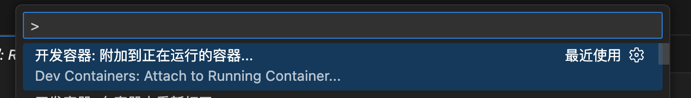
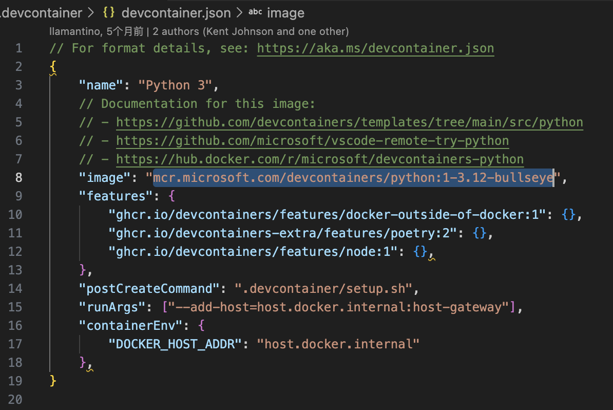

## 官方文档

**开发文档**

https://github.com/OpenHands/OpenHands/blob/main/Development.md


本地环境安装文档

https://docs.openhands.dev/openhands/usage/run-openhands/local-setup


**自定义sandbox沙箱镜像**

> 已有沙箱镜像，或者自定义创建了沙箱镜像，就不用再拉取镜像了

https://docs.openhands.dev/openhands/usage/advanced/custom-sandbox-guide

修改配置文件: config.toml

```shell
[core]
...
[sandbox]
base_container_image="custom-image"
```


## VsCode文档

**Developing inside a Container**

https://code.visualstudio.com/docs/devcontainers/containers


**Dev Containers FAQ**

https://code.visualstudio.com/docs/devcontainers/faq


**Attach to a running container**

https://code.visualstudio.com/docs/devcontainers/attach-container


**Development Containers**

https://containers.dev/


## 环境安装

### MacOS

1. [Install Docker Desktop on Mac](https://docs.docker.com/desktop/setup/install/mac-install).
2. Open Docker Desktop, go to `Settings > Advanced` and ensure `Allow the default Docker socket to be used` is enabled.

Tested with Ubuntu 22.04.

### Linux

> Tested with Ubuntu 22.04.
>
> 只安装docker或者docker-ce，无法正常搭建好环境

**Docker Desktop**

1. [Install Docker Desktop on Linux](https://docs.docker.com/desktop/setup/install/linux/).

### Windows

**WSL**

1. [Install WSL](https://learn.microsoft.com/en-us/windows/wsl/install).
2. Run `wsl --version` in powershell and confirm `Default Version: 2`.

**Ubuntu (Linux Distribution)**

1. Install Ubuntu: `wsl --install -d Ubuntu` in PowerShell as Administrator.
2. Restart computer when prompted.
3. Open Ubuntu from Start menu to complete setup.
4. Verify installation: `wsl --list` should show Ubuntu.

**Docker Desktop**

1. [Install Docker Desktop on Windows](https://docs.docker.com/desktop/setup/install/windows-install).
2. Open Docker Desktop, go to `Settings` and confirm the following:

- General: `Use the WSL 2 based engine` is enabled.
- Resources > WSL Integration: `Enable integration with my default WSL distro` is enabled.

The docker command below to start the app must be run inside the WSL terminal. Use `wsl -d Ubuntu` in PowerShell or search “Ubuntu” in the Start menu to access the Ubuntu terminal.


### 代码依赖

安装python：

安装pipx：pip install pipx

安装poetry：pipx install poetry

添加更新依赖：poetry install


### 安装VsCode

#### 禁止VsCode自动更新（推荐）

> 远程连接需要在容器内部安装VsCode Server端，客户端更新，连接Server端也会更新，相对耗时

在 VS Code 中禁止自动更新，可以通过修改设置来实现。以下是具体方法（适用于 **VS Code 桌面版**，包括 Windows、macOS 和 Linux）：

------

##### ✅ 方法一：通过设置界面禁用更新（推荐）

1. 打开 VS Code。
2. 进入设置：
   - **Windows/Linux**：`文件 (File)` → `首选项 (Preferences)` → `设置 (Settings)`
   - **macOS**：`Code` → `Preferences` → `Settings`
3. 在搜索框中输入 `update mode`。
4. 找到 **`Update: Mode`** 选项。
5. 将其值从默认的 `default` 改为 **`none`**。

> 效果：VS Code 将完全禁止检查和安装任何更新（包括安全更新）。

------

##### ✅ 方法二：通过 `settings.json` 配置

1. 打开命令面板（`Ctrl+Shift+P` 或 `Cmd+Shift+P`）。
2. 输入并选择 **`Preferences: Open Settings (JSON)`**。
3. 在打开的 `settings.json` 文件中添加以下行：

```json
1{
2  "update.mode": "none"
3}
```

保存即可。

------

##### ⚠️ 注意事项

- 设置

  ```
  "update.mode": "none" 
  ```

  仅对 VS Code 桌面应用程序本身生效

  ，不影响：

  - Extensions（扩展）的自动更新（可通过 `"extensions.autoUpdate": false` 单独关闭）
  - Dev Container 或远程开发环境中的工具更新

- 如果你使用的是 **VS Code Insiders 版本**，同样适用上述设置。

- 在企业环境中，也可以通过组策略（Windows）或配置文件集中管理此设置。

------

##### 🔒 额外：禁止扩展自动更新（可选）

如果你也想禁止扩展自动更新，加上：

```json
1{
2  "extensions.autoUpdate": false
3}
```

------

完成以上设置后，VS Code 就不会再提示或自动下载新版本了。如需手动更新，需重新启用更新或从官网下载安装包覆盖安装。


## 在Docker container开发

### 官方方式devcontainer

#### 安装docker compose

##### 命令行docker安装

`docker compose`: Docker CLI 插件，新版，docker-compose集成在 Docker Desktop 或通过 `docker-compose-plugin` 安装

**yum安装 `docker-compose-plugin`**

> yum 安装的docker，使用该方式

```shell
sudo yum install docker-compose-plugin
# 或 dnf（较新版本）
sudo dnf install docker-compose-plugin
```

**手动安装（通用）：**

```shell
# 获取最新版本号
VERSION=$(curl -s https://api.github.com/repos/docker/compose/releases/latest | grep tag_name | cut -d '"' -f 4)

# 下载插件（注意架构：amd64 / arm64）
mkdir -p ~/.docker/cli-plugins
curl -SL "https://github.com/docker/compose/releases/download/${VERSION}/docker-compose-$(uname -s)-$(uname -m)" -o ~/.docker/cli-plugins/docker-compose

# 赋予执行权限
chmod +x ~/.docker/cli-plugins/docker-compose

# 举例：https://github.com/docker/compose/releases/download/v2.40.3/docker-compose-linux-x86_64
```

**验证**

```
docker compose version
# 应输出：Docker Compose version v2.x.x
```


##### 在 Windows 或 macOS 上使用 **Docker Desktop**

- **Docker Desktop 默认已内置 `docker compose`**（v2+）；
- 如果报错，说明：
  - Docker Desktop 版本太旧（< 3.4）
  - Compose V2 被禁用

解决方法：

1. **升级 Docker Desktop** 到最新版；

2. 打开 Docker Desktop → Settings →General

   - ✅ 勾选 **“Use Docker Compose V2”**

3. 重启 Docker Desktop；

4. 验证：

   ```powershell
   docker compose version
   ```


#### 安装vscode远程开发插件

**Remote Development**

> 支持`Attach to Running Kubernetes Container...`

包含4个插件包：

- WSL
- Dev Containers：支持`Dev Containers: Reopen in Container`
- Remote - SSH
- Remote - Tunnels


**Dev Containers**

https://marketplace.visualstudio.com/items?itemName=ms-vscode-remote.remote-containers


**Remote Development**

https://marketplace.visualstudio.com/items?itemName=ms-vscode-remote.vscode-remote-extensionpack


#### 创建dev容器环境

```shell
cd containers/dev
./dev.sh

# 执行containers/dev/compose.yml的docker-compose的相关内容

# 代码挂载在/app目录下
# 执行完成命令后，命令行显示为下面这种形式表示已创建好镜像，并启动容器
# 第一次执行会创建镜像等耗时较长(创建镜像+拉取镜像+安装VsCode Server)，后面执行立即返回(docker-compose up效果)
root@76a5c21f8e84:/app# 
```

- 创建名为openhands:dev的镜像
- 运行该镜像的容器用于调试，名称为：dev-dev-run-xxx随机数
- 需要下载的运行时镜像


#### VsCode连接容器环境

> VsCode快捷键：(Ctrl+Shift+P)


#### 连接容器环境

连接运行的容器

```shell
Dev Containers: Attach to Running Container...
```



安全确认


容器选择

```shell
/dev-dev-xxxx的容器，镜像是openhands:dev
```


> 连接容器，会在容器中下载对应版本的VsCode


#### VsCode打开代码

> 目录选择

/app


选择python环境

root@76a5c21f8e84:/app# source /root/.cache/pypoetry/virtualenvs/openhands-ai-9TtSrW0h-py3.12/bin/activate


VsCode安装插件

> python开发调试插件

- Python
- Python Debugger


#### 编译、运行前端

> 新开终端，运行会一个占用终端。会拉取nodejs依赖库代理，有代理会更快。

```shell
cd frontend
npm install
npm run build
```


创建调试文件

```json
{
    // 使用 IntelliSense 了解相关属性。 
    // 悬停以查看现有属性的描述。
    // 欲了解更多信息，请访问: https://go.microsoft.com/fwlink/?linkid=830387
    "version": "0.2.0",
    "configurations": [
        {
            "name": "Python 调试程序: 包含参数的当前文件",
            "type": "debugpy",
            "request": "launch",
            "program": "${workspaceFolder}/openhands/server/__main__.py",
            "cwd": "${workspaceFolder}",
            "console": "integratedTerminal",
            "args": ["--reload", "--port", "3000"]
        }
    ]
}
```


#### 启动调试

> 设置好断点，F5启动调试


打开浏览器访问

http://127.0.0.1:3000


配置大模型信息，创建新的对话


1. 会下载镜像，镜像根据从github下载的代码版本有关

```shell
ghcr.io/openhands/agent-server:15f565b-python
```

代码的路径：`openhands/app_server/sandbox/sandbox_spec_service.py`


2. 运行时环境

   > 下载镜像

   ```shell
   ghcr.io/openhands/runtime:0.62-nikolaik
   ```

   不用下载`ghcr.io/openhands/openhands:0.62`，这个镜像就是调试server端的代码。

3. 使用镜像运行容器

   

   


### 社区方式devcontainer

#### 安装docker buildx

**下载docker buildx**

VS Code 的 Dev Containers（尤其是较新版本）默认会尝试使用 `docker buildx` 来构建镜像（因为它支持 BuildKit、多平台构建等高级功能）。

> 创建镜像的时候需要用到docker buildx命令，buildx是docker的插件。
>
> `docker buildx` 是 Docker 的一个 **CLI 插件**，并不是所有 Docker 安装都默认包含它。

**下载最新 buildx 插件**

```shell
mkdir -p ~/.docker/cli-plugins

# 查看当前最新版本
curl -s https://api.github.com/repos/docker/buildx/releases/latest | grep tag_name | cut -d '"' -f 4 | cut -c 2-

# 安装最新版本
curl -SL "https://github.com/docker/buildx/releases/latest/download/buildx-v$(curl -s https://api.github.com/repos/docker/buildx/releases/latest | grep tag_name | cut -d '"' -f 4 | cut -c 2-).linux-amd64" -o ~/.docker/cli-plugins/docker-buildx
```

**验证下载**

```shell
# 确认插件文件存在且可执行
ls -l ~/.docker/cli-plugins/docker-buildx -h
# 正常输出应类似：有执行权限，大小单位为MB，而不是几十KB
# -rwxr-xr-x 1 root root 68M 11月 23 15:34 /root/.docker/cli-plugins/docker-buildx

# 快速检查是否下载了真实二进制：
file ~/.docker/cli-plugins/docker-buildx
# 正确应显示：ELF 64-bit LSB executable, x86-64...
# 如果显示：ASCII text 或 HTML document → 说明下载的是错误页面！
```

**验证执行权限**

> 不需要重启docker

```shell
# 赋予执行权限
chmod +x ~/.docker/cli-plugins/docker-buildx

# 验证
docker buildx version
# 输出类似：github.com/docker/buildx v0.30.1 ...

# 手动验证
~/.docker/cli-plugins/docker-buildx version

# 测试能否创建 builder
docker buildx create --use

# 测试 buildx 是否能驱动 BuildKit
# docker buildx create --name test --use
# docker buildx inspect --bootstrap
# 如果 inspect 显示状态为 running，说明兼容性没问题。
```


**安装指定版本**

```shell
curl -L https://github.com/docker/buildx/releases/latest/download/buildx-v0.30.1.linux-amd64 -o ~/.docker/cli-plugins/docker-buildx
```


#### 打开远程容器环境.devcontainer

> 会用.devcontainer文件夹下的devcontainer.json来配置和启动容器环境。
>
> 这种运行OpenHands的方式并非官方支持，而是由社区维护的。

会下载镜像：

- `mcr.microsoft.com/devcontainers/python:1-3.12-bullseye`
- `moby/buildkit:buildx-stable-1`




1. **用 VS Code 打开项目根目录**

   > 项目根目录必须包含`.devcontainer/devcontainer.json`文件

   **方式一：命令行打开**

   ```bash
   cd /path/to/your/project
   
   # 在项目目录中执行，不需要在.devcontainer目录下执行
   code .
   ```

   **方式二：VsCode直接打开项目**

   选择项目根目录

2. **手动触发“在容器中重新打开”**

   - 按快捷键：`Ctrl+Shift+P`（Windows/Linux）或 `Cmd+Shift+P`（macOS）

   - 输入命令：

     ```text
     Dev Containers: Reopen in Container
     ```

     > 第一次执行Reopen in Container，后续执行Attach to Running Container...。

   - 回车执行

   - **读取开发容器配置(显示日志)，看是否报错**

   - devcontainer.json文件已存在，点击`继续`。点击`取消`则终止连接容器。

     

   - 添加开发容器配置文件：

     

     

3. **VS Code 会自动执行以下流程：**

   > 过程中会下载镜像和代码，安装部分工具。**如果有代理会更快。**

   - 构建 Docker 镜像（首次较慢）/ 使用指定的镜像(**会拉取基础镜像**)
   - **自动下载并执行每个 Feature 的安装脚本**（通常是 shell 脚本），官方 Feature 库：https://containers.dev/features
   - **按顺序安装指定的工具/服务**
   - **最终生成一个包含所有所需开发工具的容器环境**（vsc-propject-xxx）
     - (vsc-openhands-3724fa83fea081c6d98f7b69a59f554d5c405fcad09a5c5a7c23eda45dadcfee-features)
   - 启动容器
   - 挂载项目代码
   - 安装指定的 VS Code 扩展
   - 打开终端（此时已在容器内）

✅ 成功后，VS Code 左下角状态栏会显示容器名称（如 `Dev Container: YourProject`）。


#### 🔍 如何确认容器是否在运行？

终端执行：

```bash
docker ps
```

你会看到类似：

```text
CONTAINER ID   IMAGE                     COMMAND                  ...
abcd1234       vsc-yourproject-xxxxxx   "/bin/sh -c 'echo Co…"   ...
```

这个就是 Dev Container 创建的容器。


#### 连接到一个**已经运行的 Dev Container**

如果你之前已经启动过容器，但关闭了 VS Code，现在想重新连接：

1. 打开 VS Code

2. ```text
   Ctrl+Shift+P
   ```

   → 输入：

   ```text
   Dev Containers: Attach to Running Container...
   ```

1. 从列表中选择对应的容器（通常以项目名或镜像名标识）
2. VS Code 会 attach 进去，并挂载原项目目录（需路径一致）

> ⚠️ 注意：Attach 模式不会自动挂载代码，建议优先使用 “Reopen in Container”。


### k8s方式

> 这个是连接k8s的容器环境，没有安装k8s，我们使用的docker容器环境调试，说以不要选择这个。

```shell
Dev Containers: Attach to Running Kubernetes Container...
```

