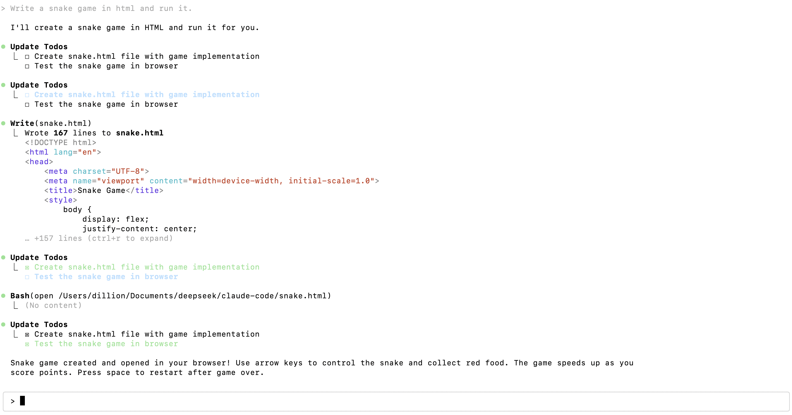
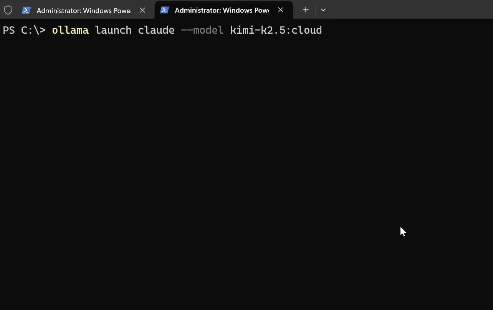
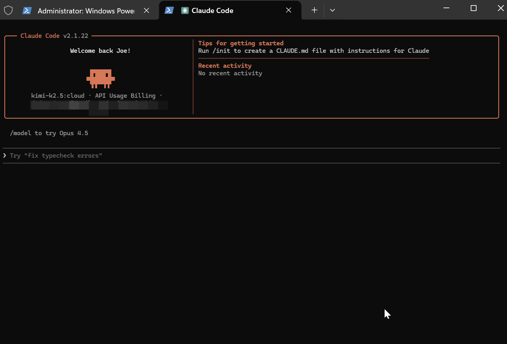
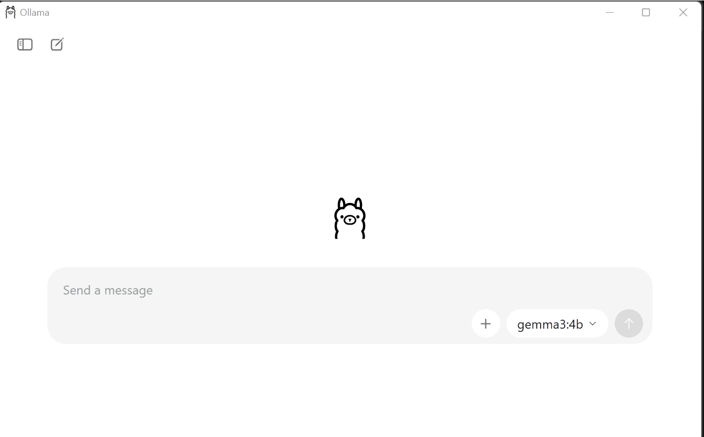

### 参考

https://zhuanlan.zhihu.com/p/1930035012171970397

https://github.com/musistudio/claude-code-router

https://github.com/musistudio/claude-code-router/blob/main/README_zh.md

https://github.com/d-kimuson/claude-code-viewer

https://github.com/kirodotdev/Kiro

https://kiro.dev/

https://github.com/siteboon/claudecodeui

https://lazycat.cloud/playground/guideline/1416


### Claude Code

https://www.npmjs.com/package/@anthropic-ai/claude-code

https://www.npmjs.com/package/@anthropic-ai/claude-code?activeTab=versions

[2.0.74](https://www.npmjs.com/package/@anthropic-ai/claude-code/v/2.0.74)


### 安装部署

#### Claude Code Router

https://www.npmjs.com/package/@musistudio/claude-code-router


##### 卸载

> 如果存在旧版本，希望卸载

```shell
# 1. 卸载现有版本
npm uninstall -g @anthropic-ai/claude-code
npm uninstall -g @musistudio/claude-code-router

# 2. 清理 npm 缓存
npm cache clean --force

# 3. 清理 ccr 本地配置缓存

rm -rf ~/.claude-code-router/cache
```


##### 安装

https://github.com/musistudio/claude-code-router

```shell
# 默认安装最新版本
npm install -g @anthropic-ai/claude-code
npm install -g @musistudio/claude-code-router

# 安装制定版本、指定最后版本
npm install -g @anthropic-ai/claude-code@2.0.74
npm install -g @musistudio/claude-code-router@latest

# 安装 node-fetch 并覆盖内置 fetch
npm install -g node-fetch@3
```


##### 配置

> vi ~/.claude-code-router/config.json

**deepseek示例：**

```json
{
  "APIKEY": "", // ccr的界面登录密码
  "PROXY_URL": "http://127.0.0.1:7890", // 如果有代理，配置的代理地址。注意如果是wsl，需要配置对饮的主机的代理ip，不是127.0.0.1。可以通过route -n查看。
  "LOG": true,
  "API_TIMEOUT_MS": 600000,
  "NON_INTERACTIVE_MODE": false,
  "Providers": [
    {
      "name": "deepseek",
      "api_base_url": "https://api.deepseek.com/chat/completions",
      "api_key": "", // deepseek的key
      "models": [
        "deepseek-chat"
      ],
      "transformer": {
        "use": [
          "deepseek"
        ],
        "deepseek-chat": {
          "use": [
            "tooluse"
          ]
        }
      }
    }
  ],
  "Router": {
    "default": "deepseek,deepseek-chat"
  }
}
```


**完整示例：**

```json
{
  "APIKEY": "your-secret-key",
  "PROXY_URL": "http://127.0.0.1:7890",
  "LOG": true,
  "API_TIMEOUT_MS": 600000,
  "NON_INTERACTIVE_MODE": false,
  "Providers": [
    {
      "name": "openrouter",
      "api_base_url": "https://openrouter.ai/api/v1/chat/completions",
      "api_key": "sk-xxx",
      "models": [
        "google/gemini-2.5-pro-preview",
        "anthropic/claude-sonnet-4",
        "anthropic/claude-3.5-sonnet",
        "anthropic/claude-3.7-sonnet:thinking"
      ],
      "transformer": {
        "use": ["openrouter"]
      }
    },
    {
      "name": "deepseek",
      "api_base_url": "https://api.deepseek.com/chat/completions",
      "api_key": "sk-xxx",
      "models": ["deepseek-chat", "deepseek-reasoner"],
      "transformer": {
        "use": ["deepseek"],
        "deepseek-chat": {
          "use": ["tooluse"]
        }
      }
    },
    {
      "name": "ollama",
      "api_base_url": "http://localhost:11434/v1/chat/completions",
      "api_key": "ollama",
      "models": ["qwen2.5-coder:latest"]
    },
    {
      "name": "gemini",
      "api_base_url": "https://generativelanguage.googleapis.com/v1beta/models/",
      "api_key": "sk-xxx",
      "models": ["gemini-2.5-flash", "gemini-2.5-pro"],
      "transformer": {
        "use": ["gemini"]
      }
    },
    {
      "name": "volcengine",
      "api_base_url": "https://ark.cn-beijing.volces.com/api/v3/chat/completions",
      "api_key": "sk-xxx",
      "models": ["deepseek-v3-250324", "deepseek-r1-250528"],
      "transformer": {
        "use": ["deepseek"]
      }
    },
    {
      "name": "modelscope",
      "api_base_url": "https://api-inference.modelscope.cn/v1/chat/completions",
      "api_key": "",
      "models": ["Qwen/Qwen3-Coder-480B-A35B-Instruct", "Qwen/Qwen3-235B-A22B-Thinking-2507"],
      "transformer": {
        "use": [
          [
            "maxtoken",
            {
              "max_tokens": 65536
            }
          ],
          "enhancetool"
        ],
        "Qwen/Qwen3-235B-A22B-Thinking-2507": {
          "use": ["reasoning"]
        }
      }
    },
    {
      "name": "dashscope",
      "api_base_url": "https://dashscope.aliyuncs.com/compatible-mode/v1/chat/completions",
      "api_key": "",
      "models": ["qwen3-coder-plus"],
      "transformer": {
        "use": [
          [
            "maxtoken",
            {
              "max_tokens": 65536
            }
          ],
          "enhancetool"
        ]
      }
    },
    {
      "name": "aihubmix",
      "api_base_url": "https://aihubmix.com/v1/chat/completions",
      "api_key": "sk-",
      "models": [
        "Z/glm-4.5",
        "claude-opus-4-20250514",
        "gemini-2.5-pro"
      ]
    }
  ],
  "Router": {
    "default": "deepseek,deepseek-chat",
    "background": "ollama,qwen2.5-coder:latest",
    "think": "deepseek,deepseek-reasoner",
    "longContext": "openrouter,google/gemini-2.5-pro-preview",
    "longContextThreshold": 60000,
    "webSearch": "gemini,gemini-2.5-flash"
  }
}
```


##### 启动

```shell
ccr start   # 启动ccr
ccr restart # 修改配置后重启
ccr code    # 启动claude code
ccr ui      # 启动ui界面：http://127.0.0.1:3456/ui/
ccr model   # 对于偏好终端工作流的用户，可以使用交互式 CLI 模型选择器
```


##### 预设管理

```shell
# 将当前配置导出为预设
ccr preset export my-preset

# 使用元数据导出
ccr preset export my-preset --description "我的 OpenAI 配置" --author "您的名字" --tags "openai,生产环境"

# 从本地目录安装预设
ccr preset install /path/to/preset

# 列出所有已安装的预设
ccr preset list

# 显示预设信息
ccr preset info my-preset

# 删除预设
ccr preset delete my-preset
```


##### 接口验证

默认端口：3456，跟ccr ui是同一个端口

认证信息，APIKEY：123456，上面配置文件配置的

```json
curl http://localhost:3456/v1/chat/completions \
  -H "Content-Type: application/json" \
  -H "Authorization: Bearer 123456" \
  -d '{
    "model": "deepseek,deepseek-chat",
    "messages": [{"role": "user", "content": "hello"}]
  }'
```


#### DeepSeek

https://api-docs.deepseek.com/zh-cn/guides/anthropic_api


##### Anthropic API

为了满足大家对 Anthropic API 生态的使用需求，我们的 API 新增了对 Anthropic API 格式的支持。通过简单的配置，即可将 DeepSeek 的能力，接入到 Anthropic API 生态中。

------

##### 将 DeepSeek 模型接入 Claude Code

1. 安装 Claude Code

```text
npm install -g @anthropic-ai/claude-code
```

2. 配置环境变量

```text
export ANTHROPIC_BASE_URL=https://api.deepseek.com/anthropic
export ANTHROPIC_AUTH_TOKEN=${DEEPSEEK_API_KEY}
export API_TIMEOUT_MS=600000
export ANTHROPIC_MODEL=deepseek-chat
export ANTHROPIC_SMALL_FAST_MODEL=deepseek-chat
export CLAUDE_CODE_DISABLE_NONESSENTIAL_TRAFFIC=1
```

注：设置`API_TIMEOUT_MS`是为了防止输出过长，触发 Claude Code 客户端超时，这里设置的超时时间为 10 分钟。

3. 进入项目目录，执行 `claude` 命令，即可开始使用了。

```text
cd my-project
claude
```



------

##### 通过 Anthropic API 调用 DeepSeek 模型

1. 安装 Anthropic SDK

```text
pip install anthropic
```

1. 配置环境变量

```text
export ANTHROPIC_BASE_URL=https://api.deepseek.com/anthropic
export ANTHROPIC_API_KEY=${YOUR_API_KEY}
```

1. 调用 API

```text
import anthropic

client = anthropic.Anthropic()

message = client.messages.create(
    model="deepseek-chat",
    max_tokens=1000,
    system="You are a helpful assistant.",
    messages=[
        {
            "role": "user",
            "content": [
                {
                    "type": "text",
                    "text": "Hi, how are you?"
                }
            ]
        }
    ]
)
print(message.content)
```

**注意**：当您给 DeepSeek 的 Anthropic API 传入不支持的模型名时，API 后端会自动将其映射到 `deepseek-chat` 模型。

------

##### Anthropic API 兼容性细节

###### HTTP Header

| Field             | Support Status  |
| ----------------- | --------------- |
| anthropic-beta    | Ignored         |
| anthropic-version | Ignored         |
| x-api-key         | Fully Supported |

###### Simple Fields

| Field          | Support Status                         |
| -------------- | -------------------------------------- |
| model          | Use DeepSeek Model Instead             |
| max_tokens     | Fully Supported                        |
| container      | Ignored                                |
| mcp_servers    | Ignored                                |
| metadata       | Ignored                                |
| service_tier   | Ignored                                |
| stop_sequences | Fully Supported                        |
| stream         | Fully Supported                        |
| system         | Fully Supported                        |
| temperature    | Fully Supported (range [0.0 ~ 2.0])    |
| thinking       | Supported (`budget_tokens` is ignored) |
| top_k          | Ignored                                |
| top_p          | Fully Supported                        |

###### Tool Fields

**tools**

| Field         | Support Status  |
| ------------- | --------------- |
| name          | Fully Supported |
| input_schema  | Fully Supported |
| description   | Fully Supported |
| cache_control | Ignored         |

**tool_choice**

| Value | Support Status                                     |
| ----- | -------------------------------------------------- |
| none  | Fully Supported                                    |
| auto  | Supported (`disable_parallel_tool_use` is ignored) |
| any   | Supported (`disable_parallel_tool_use` is ignored) |
| tool  | Supported (`disable_parallel_tool_use` is ignored) |

###### Message Fields

| Field                                      | Variant         | Sub-Field       | Support Status  |
| ------------------------------------------ | --------------- | --------------- | --------------- |
| content                                    | string          |                 | Fully Supported |
| array, type="text"                         | text            | Fully Supported |                 |
| cache_control                              | Ignored         |                 |                 |
| citations                                  | Ignored         |                 |                 |
| array, type="image"                        |                 | Not Supported   |                 |
| array, type = "document"                   |                 | Not Supported   |                 |
| array, type = "search_result"              |                 | Not Supported   |                 |
| array, type = "thinking"                   |                 | Supported       |                 |
| array, type="redacted_thinking"            |                 | Not Supported   |                 |
| array, type = "tool_use"                   | id              | Fully Supported |                 |
| input                                      | Fully Supported |                 |                 |
| name                                       | Fully Supported |                 |                 |
| cache_control                              | Ignored         |                 |                 |
| array, type = "tool_result"                | tool_use_id     | Fully Supported |                 |
| content                                    | Fully Supported |                 |                 |
| cache_control                              | Ignored         |                 |                 |
| is_error                                   | Ignored         |                 |                 |
| array, type = "server_tool_use"            |                 | Not Supported   |                 |
| array, type = "web_search_tool_result"     |                 | Not Supported   |                 |
| array, type = "code_execution_tool_result" |                 | Not Supported   |                 |
| array, type = "mcp_tool_use"               |                 | Not Supported   |                 |
| array, type = "mcp_tool_result"            |                 | Not Supported   |                 |
| array, type = "container_upload"           |                 | Not Supported   |                 |


#### Ollama

> Ollama Launch For Claude Code, Codex, OpenCode 

https://www.hubwiz.com/blog/kimi-k2-5-claude-code-test/

https://zhuanlan.zhihu.com/p/2000144619330111357


环境准备：

1. 已安装 Ollama v0.15
2. 已安装 Claude Code
3. Ollama Cloud 帐户（用于云模型）


##### 运行 claude code

```shell
ollama pull kimi-k2.5:cloud

ollama launch claude --model kimi-k2.5:cloud
```




ollama会自动做以下事项：

- 设置 `ANTHROPIC_AUTH_TOKEN`
- 配置 `ANTHROPIC_BASE_URL` 到 localhost:11434
- 使用选定的模型启动 Claude Code


验证已做的事项：

> Claude Code 启动后，运行 `/status` 以确认：

```text
Model: kimi-k2.5:cloud
Auth token: ANTHROPIC_AUTH_TOKEN
Anthropic base URL: http://localhost:11434
```



##### 上下文长度说明

云模型以完整上下文长度运行（Kimi K2.5 为 256K）。

> **如果你使用的是本地模型，你需要在 Ollama 设置中调整上下文长度。**



使用云模型时，跳过此步骤。
