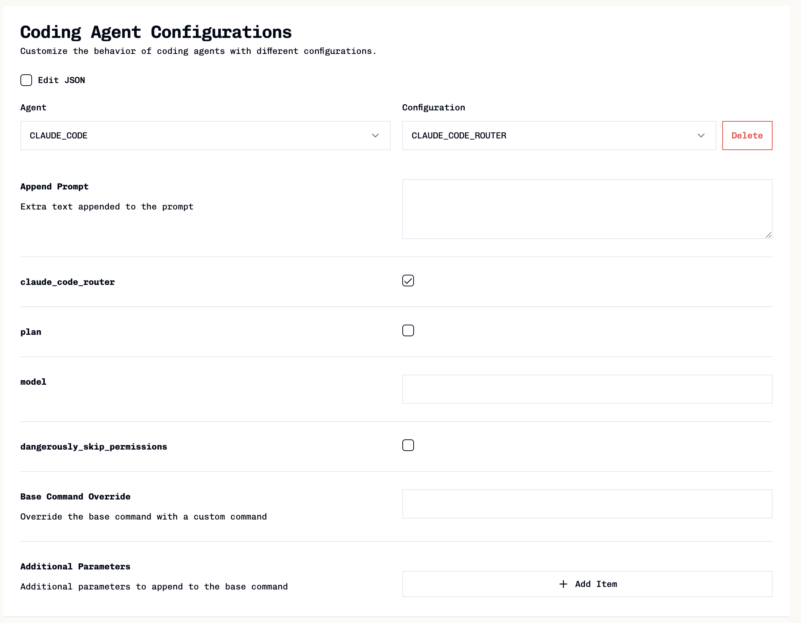
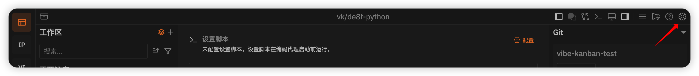
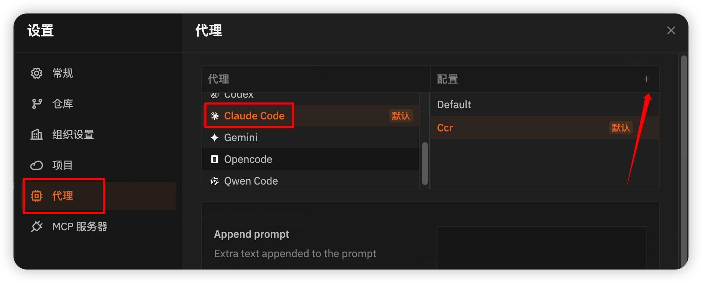
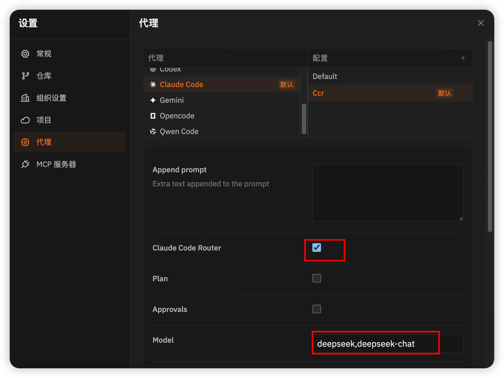

# Vibe Kanban

开源地址：

https://github.com/BloopAI/vibe-kanban

https://gitcode.com/GitHub_Trending/vi/vibe-kanban


官方文档：

https://vibekanban.com/docs


CCR支持：

https://vibekanban.com/docs/agents/ccr

https://vibekanban.com/docs/agents/ccr.md


https://github.com/musistudio/claude-code-router

https://github.com/musistudio/claude-code-router/blob/main/README_zh.md


### [Configure Vibe Kanban](https://vibekanban.com/docs/agents/ccr#configure-vibe-kanban)

Vibe Kanban does not ship a default configuration for CCR. Add configurations to the existing Claude Code agent:

1. Open the “Coding Agent Configurations” page.
2. Add a new configuration for the Claude Code agent (or edit an existing one).
3. Enable the `claude_code_router` checkbox.
4. Optionally set a model string to target a specific CCR provider/model.

See the [Agent Profiles & Variants](https://vibekanban.com/docs/settings/agent-configurations) guide for managing agent configurations.Model string format: `<provider>,<model-name>`Examples:

```
openrouter,moonshotai/kimi-k2-0905
deepseek,deepseek-chat
```

Tips:

- Create multiple configurations if you want easy switching between different models.
- Leave the model string empty if you want CCR to use its own routing based on your CCR UI configuration (e.g., its `default`/`longContext`/etc. mappings).

**[Example: Claude Code agent configuration in Vibe Kanban](https://vibekanban.com/docs/agents/ccr#example-claude-code-agent-configuration-in-vibe-kanban)**



**[Using CCR in Vibe Kanban](https://vibekanban.com/docs/agents/ccr#using-ccr-in-vibe-kanban)**

When creating a Task Attempt, select the coding agent and configuration: choose the Claude Code agent, then pick one of your CCR-enabled configurations.

**[Troubleshooting](https://vibekanban.com/docs/agents/ccr#troubleshooting)**

- Authentication errors: verify your API keys/provider settings in CCR (via UI or JSON config).
- Model not found: confirm the model identifier is correct for the chosen provider.
- Missing features (webSearch/think/image): switch to a model that supports the capability and update your CCR mapping (via UI or JSON config).


### 安装 和 运行

#### 安装

```bash
npx vibe-kanban
```


#### 使用Claude Code Route

1. 设置



2. 添加配置



3. 勾选CCR，设置模型




### 参考

https://momomo.blog.csdn.net/article/details/156596302