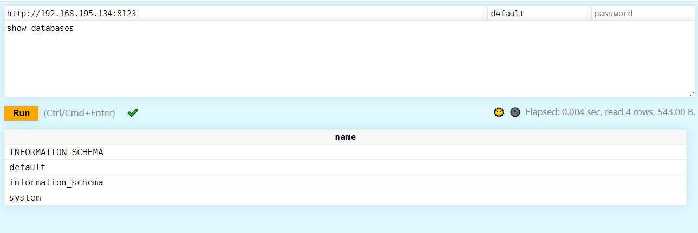
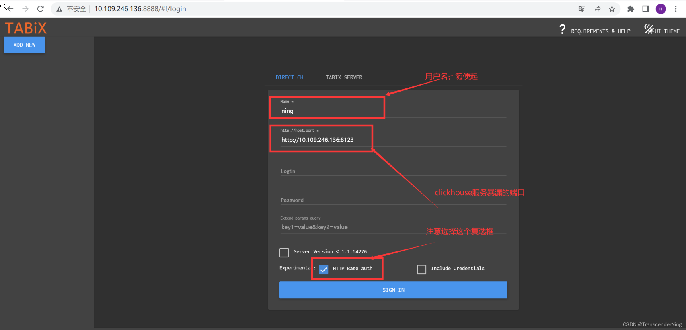

# 部署ClickHouse


## 1、部署服务端

```shell
docker run -d --name clickhouse-server --ulimit nofile=262144:262144 -p 9000:9000 -p 8123:8123 --volume=$(pwd)/clickhouse-server:/etc/clickhouse-server --volume=$(pwd)/clickhouse:/var/lib/clickhouse yandex/clickhouse-server
```

/etc/clickhouse-server	配置文件目录

/var/lib/clickhouse			数据库数据文件目录


## 2、客户端访问

```shell
docker run -it --rm --link clickhouse-server:clickhouse-server yandex/clickhouse-client --host clickhouse-server
```

完整参数实例

```shell
clickhouse-client -h x.x.x.x -d default -m -u default --password 'xxx'
```


### 客户端命令行参数

```shell
clickhouse-client
    --host, -h     	：服务端host名称，默认 localhost
    --port         	：连接端口，默认9000
    --user, -u     	：用户名，默认 default
    --password     	：密码，默认空
    --query, -q    	：非交互模式下的查询语句
    --database, -d 	：默认当前操作的数据库，默认default
    --multiline, -m ：允许多行语句查询，在clickhouse中默认回车即为sql结束，可使用该参数多行输入
    --format, -f		：使用指定的默认格式输出结果      csv,以逗号分隔
    --time, -t			：非交互模式下会打印查询执行的时间
    --stacktrace		：出现异常会打印堆栈跟踪信息
    --config-file		：配置文件名称
```


## 3、客户端访问

### 3.1 http访问

http端口8123

```shell
$ curl 'http://localhost:8123/'
Ok.
```

web页面

```shell
http://localhost:8123/play
http://192.168.195.134:8123/play
```




### 3.2 创建测试数据库和表

```sql
CREATE DATABASE docker;
CREATE TABLE docker.docker (x Int32) ENGINE = Log;
```


### 3.2 DBeaver访问

- [DBeaver连接clickhouse（超详细图文教程）](https://blog.csdn.net/fy512/article/details/123482700)
- [DBeaver安装与使用教程（超详细安装与使用教程）](https://blog.csdn.net/fy512/article/details/121335289)


### 3.3 Tabix

- [docker部署clickhouse以及Tabix可视化工具](https://blog.csdn.net/weixin_45514285/article/details/127433775)
- [docker 安装clickhouse-server+clickhouse-client+Tabix](https://blog.csdn.net/m0_37813354/article/details/109526076)


```shell
docker run -d --name tabix -p 8000:80 -e user='' -e password='' spoonest/clickhouse-tabix-web-client:latest
```





## 4、设置密码

采用SHA256的方式加密，生成明码密文

```shell
[root@localhost clickhouse]# PASSWORD=$(base64 < /dev/urandom | head -c8); echo "wwmin2022"; echo -n "wwmin2022" | sha256sum | tr -d '-'

wwmin2022
76a0ec4d00df76517c8f26f138bb57ffb987de2f9999bd9a61c3745bdb7ada35
```

明文密码 : wwm2022
加密密码 : 76a0ec4d00df76517c8f26f138bb57ffb987de2f9999bd9a61c3745bdb7ada35
将明文密码替换你自己的密码,生成加密密码即可


配置路径

```text
clickhouse-server/preprocessed_configs/users.xml
```

```xml
<password>wwm2022</password>
<password_sha256_hex>76a0ec4d00df76517c8f26f138bb57ffb987de2f9999bd9a61c3745bdb7ada35</password_sha256_hex>
```


使用新的密码访问

```shell
clickhouse-client -h x.x.x.x -d default -m -u default --password 'wwm2022'
```


## 参考

- [dockerhub](https://hub.docker.com/r/yandex/clickhouse-server)
- [docker 安装 clickhouse](https://www.jianshu.com/p/921a0d82c7b8)
- [Docker部署clickhouse（超详细图文教程）](https://blog.csdn.net/fy512/article/details/123482700)
- [DBeaver连接clickhouse（超详细图文教程）](https://blog.csdn.net/fy512/article/details/123482700)
- [DBeaver安装与使用教程（超详细安装与使用教程）](https://blog.csdn.net/fy512/article/details/121335289)
- [clickhouse官方HTTP接口说明文档](https://clickhouse.com/docs/en/interfaces/http)
- [docker部署clickhouse以及Tabix可视化工具](https://blog.csdn.net/weixin_45514285/article/details/127433775)
- [docker 安装clickhouse-server+clickhouse-client+Tabix](https://blog.csdn.net/m0_37813354/article/details/109526076)